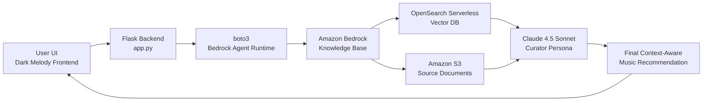

# Melody - AI-Powered Music Discovery Assistant

**Melody** is a high-tech AI music discovery assistant built to help listeners break out of algorithmic echo chambers. Instead of returning shallow similarity matches, Melody uses a custom **Retrieval-Augmented Generation (RAG)** pipeline over curated music data, reviews, and genre knowledge to produce deeply reasoned, context-aware recommendations.

The application combines a polished Flask web experience with **Amazon Bedrock Knowledge Bases**, **OpenSearch Serverless vector retrieval**, **S3-backed source documents**, and a carefully engineered **Claude 4.5 Sonnet curator persona**. The result is a recommendation assistant that can reason across genre history, artist descriptions, review language, and abstract user vibes like _warm_, _melancholy_, _organic_, or _high-energy_.

## Media

[Recording 2026-06-05 150227.webm](https://github.com/user-attachments/assets/b31e56e3-a6c6-464e-ad07-af1234d995e1)

<details>
  <summary>📸 <b>Click here to view App Screenshots</b></summary>
  <br>
  
 


</details>

---

## Core Features

- **AI-powered music discovery**  
  Melody answers natural-language discovery prompts such as “Songs like Bon Iver but warmer” or “Find music that blends melancholy with high infectious energy.”

- **Custom RAG pipeline on AWS**  
  User questions are sent from the Flask backend through `boto3` to an Amazon Bedrock Knowledge Base, which retrieves semantically relevant documents before generating a grounded final response.

- **Dynamic UI prompt suggestions**  
  The frontend displays **4 randomized prompt suggestions** out of a pool of **15 diverse questions** on every page load, encouraging exploration and preventing repetitive usage patterns.

- **Advanced prompt engineering: Curator Persona**  
  Melody does not behave like a raw database reader. The system prompt instructs Claude 4.5 Sonnet to act as an expert curator: cross-reference genres, maintain conversational flow, avoid exposing retrieval mechanics, and confidently pivot to the closest exciting recommendation when a perfect match is not available.

- **Dark, high-tech interface**  
  The app includes a custom animated Melody wordmark, subtle neon styling, animated ambient mesh blobs, randomized query cards, and a Spotify-inspired login preview section.

- **Container-ready deployment**  
  The repository includes a production-oriented `Dockerfile`, pinned dependencies, and a `.dockerignore` file to keep local data, virtual environments, editor metadata, and offline prep assets out of the container image.

---

## Data Architecture & Preparation

Melody’s intelligence depends heavily on the quality and structure of the source material ingested into the AWS Bedrock Knowledge Base.

### Offline Dataset Cleaning

The project includes custom offline Python scripts in the `data_prep/` directory. These scripts prepare source data before ingestion into the RAG layer:

- `data_prep/prepare_mvp_dataset.py` loads the raw music CSV dataset.
- It removes rows with missing or empty descriptions.
- It exports a cleaner dataset suitable for knowledge-base ingestion.
- This cleaning step reduces noisy records and improves retrieval quality.

This preprocessing stage is intentionally kept outside the runtime Flask app. The deployed application relies on Bedrock retrieval, not local CSV parsing.

### Musicmap Genre Collection

The project also includes a custom scraper:

- `data_prep/scrape_musicmap.py`
- Target source: `https://musicmap.info/`
- Uses `requests` and `BeautifulSoup`.
- Mimics browser headers.
- Extracts / reconstructs genre hierarchy data.
- Produces Markdown knowledge files for genre-oriented retrieval.

This scraper significantly expands the knowledge base by adding structured genre context beyond album and review metadata.

### Markdown Genre Mapping

Genre descriptions are represented as `.md` files under:

```text
data/genres_knowledge/
```

This is an important architectural choice. Markdown preserves semantic structure through headings, hierarchy, and sections. That makes it especially effective for RAG ingestion because the vector database can retain context such as:

- Main genre names
- Sub-genre relationships
- Descriptive paragraphs
- Musical characteristics
- Mood and aesthetic associations

This helps the system connect abstract user requests like **“warmer,” “melancholy,” “campfire,” “jangly,”** or **“handmade”** to relevant artists, albums, and genres during retrieval.

---

## System Architecture



### Runtime Flow

1. The user enters a discovery query in the Melody UI.
2. Flask receives the request through `/` or `/ask`.
3. The backend calls `retrieve_and_generate` through `boto3`.
4. Amazon Bedrock retrieves relevant chunks from the Knowledge Base.
5. OpenSearch Serverless performs vector similarity retrieval.
6. S3 provides the source documents used by the Knowledge Base.
7. Claude 4.5 Sonnet generates a curator-style response.
8. The final answer is returned to the UI.

---

## Project Structure

```text
Melody/
├── app.py
│   └── Flask application entrypoint, Bedrock Knowledge Base integration, prompt logic, and randomized query selection.
├── templates/
│   └── index.html
│       └── Main Melody frontend template with chat UI, Jinja rendering hooks, and client-side interaction logic.
├── static/
│   └── style.css
│       └── Extracted application styling, animations, dark theme, logo effects, and responsive UI rules.
├── data/
│   ├── cleaned_large_dataset_t.csv
│   │   └── Cleaned dataset artifact used during knowledge-base preparation.
│   ├── all_songs_rating_review/
│   │   └── Raw song metadata source files.
│   ├── Contemporary album ratings and reviews/
│   │   └── Album rating and review source data.
│   └── genres_knowledge/
│       └── Markdown genre knowledge files optimized for RAG ingestion.
├── data_prep/
│   ├── prepare_mvp_dataset.py
│   │   └── Offline CSV cleaning script for filtering incomplete music records.
│   └── scrape_musicmap.py
│       └── Offline scraper for collecting and formatting genre knowledge from musicmap.info.
├── requirements.txt
│   └── Pinned Python runtime dependencies.
├── Dockerfile
│   └── Container build definition for running the Flask app.
├── .dockerignore
│   └── Excludes local data, virtualenvs, editor files, and prep artifacts from Docker builds.
├── .gitignore
│   └── Excludes local Python, environment, and editor artifacts from Git.
└── README.md
    └── Project documentation.
```

---

## Running the Application Locally

### 1. Create and activate a virtual environment

```bash
python -m venv venv
```

Windows PowerShell:

```powershell
.\venv\Scripts\activate
```

macOS / Linux:

```bash
source venv/bin/activate
```

### 2. Install dependencies

```bash
pip install -r requirements.txt
```

### 3. Configure AWS credentials

Melody requires AWS credentials with permission to call Amazon Bedrock Knowledge Bases.

Common local options:

```bash
aws configure
```

Or export environment variables:

```bash
export AWS_ACCESS_KEY_ID="your-access-key"
export AWS_SECRET_ACCESS_KEY="your-secret-key"
export AWS_DEFAULT_REGION="us-east-2"
```

For temporary credentials:

```bash
export AWS_SESSION_TOKEN="your-session-token"
```

### 4. Run Flask

```bash
python app.py
```

Then open:

```text
http://18.226.60.121:5000
```

---

## Running with Docker

### Build the image

```bash
docker build -t melody-app .
```

### Run the container with AWS environment variables

```bash
docker run --rm -p 5000:5000 \
  -e AWS_ACCESS_KEY_ID="your-access-key" \
  -e AWS_SECRET_ACCESS_KEY="your-secret-key" \
  -e AWS_DEFAULT_REGION="us-east-2" \
  melody-app
```

If using temporary AWS credentials:

```bash
docker run --rm -p 5000:5000 \
  -e AWS_ACCESS_KEY_ID="your-access-key" \
  -e AWS_SECRET_ACCESS_KEY="your-secret-key" \
  -e AWS_SESSION_TOKEN="your-session-token" \
  -e AWS_DEFAULT_REGION="us-east-2" \
  melody-app
```

Then visit:

```text
http://localhost:5000
```

### Run with a mounted local AWS profile

macOS / Linux:

```bash
docker run --rm -p 5000:5000 \
  -v ~/.aws:/root/.aws:ro \
  -e AWS_DEFAULT_REGION="us-east-2" \
  melody-app
```

Windows PowerShell:

```powershell
docker run --rm -p 5000:5000 `
  -v "$env:USERPROFILE\.aws:/root/.aws:ro" `
  -e AWS_DEFAULT_REGION="us-east-2" `
  melody-app
```

---

## AWS Deployment & Cleanup Proof

The application was successfully containerized and deployed to a public AWS EC2 instance.

[Tested on Public IP: http://YOUR.IP.HERE:5000]

Immediately after testing and verifying the public URL, the compute-heavy and cost-generating AWS resources were deleted to prevent unnecessary costs:
1. Terminated the EC2 Instance (`Melody-App-Server`).
2. Deleted the Amazon Bedrock Knowledge Base and its associated OpenSearch Serverless vector store (to avoid hourly compute charges).
(Note: The S3 bucket containing the source files was kept intact for ongoing development, as storage costs for the dataset are negligible).

---

## AWS Components

- **Amazon Bedrock Knowledge Bases**: Handles retrieval-augmented generation orchestration.
- **Claude 4.5 Sonnet**: Generates the final recommendation response using the curator persona prompt.
- **OpenSearch Serverless**: Stores vector embeddings and performs semantic retrieval.
- **Amazon S3**: Stores source documents for ingestion.
- **Amazon EC2**: Used for public container deployment testing.
- **boto3**: Python AWS SDK used by the Flask backend.

---

## Environment and Dependency Notes

Pinned runtime dependencies:

```text
Flask==3.1.3
boto3==1.43.22
botocore==1.43.22
```

Python runtime in Docker:

```text
python:3.12-slim
```

The Flask app currently targets:

```text
AWS Region: us-east-2
Knowledge Base ID: AOGLLMF80H
Model / Inference Profile: global.anthropic.claude-sonnet-4-5-20250929-v1:0
```

---

## Security and Cost Notes

- Never commit `.env` files or AWS credentials.
- Use IAM roles for AWS-hosted deployments whenever possible.
- Keep large local datasets out of the Docker image.
- OpenSearch Serverless and EC2 can generate ongoing charges; delete unused resources after testing.
- S3 source buckets can be retained for development because storage costs are comparatively low.

---

## Why Melody Matters

Most recommendation systems optimize for repetition. Melody is designed for discovery. By combining structured genre knowledge, review metadata, curated prompt engineering, and AWS-native RAG infrastructure, Melody helps users move beyond algorithmic comfort zones and rediscover music as an exploratory, emotional, and deeply contextual experience. 🎧
