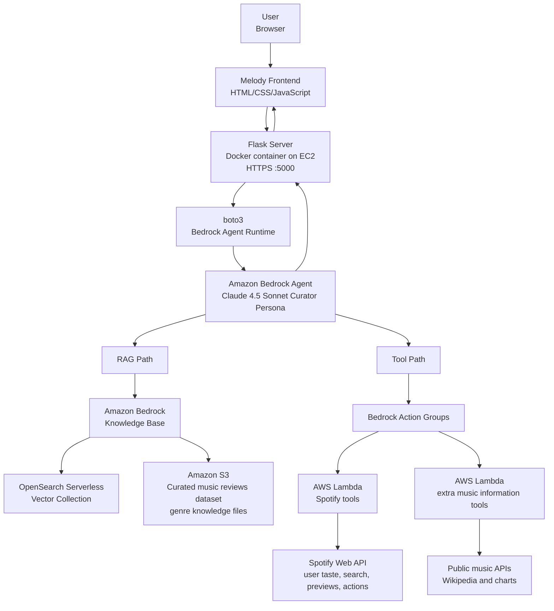

# Melody - AI-Powered Music Discovery Assistant

**Melody** is a high-tech AI music discovery assistant built to help listeners break out of algorithmic echo chambers. Instead of returning shallow similarity matches, Melody uses a custom **Retrieval-Augmented Generation (RAG)** pipeline over curated music data, reviews, and genre knowledge to produce deeply reasoned, context-aware recommendations.

The application combines a polished Flask web experience with **Amazon Bedrock Knowledge Bases**, **OpenSearch Serverless vector retrieval**, **S3-backed source documents**, and a carefully engineered **Claude 4.5 Sonnet curator persona**. The result is a recommendation assistant that can reason across genre history, artist descriptions, review language, and abstract user vibes like _warm_, _melancholy_, _organic_, or _high-energy_.

## Media

[Recording 2026-06-05 150227.webm](https://github.com/user-attachments/assets/b31e56e3-a6c6-464e-ad07-af1234d995e1)

<details>
  <summary>📸 <b>Click here to view App Screenshots</b></summary>
  <br>
  
 


</details>


---
## screenshots Proofs
<details>
  <summary>📸 <b>Click here to view knowledge base AWS Screenshots</b></summary>
  <br>


  </details>


  <details>
  <summary>📸 <b>Click here to view EC2 & Docker container running AWS Screenshots</b></summary>
  <br>


  </details>

---

## AWS Folder and Deployment Artifacts

Under the `aws/` folder you can find the relevant deployment artifacts, Bedrock Action Group schemas, and Lambda packaging materials used for the next steps of the project. These files document how Melody connects the Flask application to AWS Bedrock, Lambda tools, Spotify API actions, and external music-information services.

Important AWS-related project assets include:

- `aws/bedrock_schemas/SpotifyTools.json` - OpenAPI-style schema for Spotify-related Bedrock Agent tools.
- `aws/bedrock_schemas/Extra_music_Tools.json` - Schema for additional music-information tools.
- `aws/lambda_spotify_package/` - Packaged Spotify Lambda Action Group code and dependencies.
- `aws/info_lambda_package/` - Packaged extra music-information Lambda code and dependencies.

These artifacts support reproducibility for grading and make the AWS integration transparent for future deployment, debugging, and cleanup.

---

## Core Features

- **AI-powered music discovery**  
  Melody answers natural-language discovery prompts such as “Songs like Bon Iver but warmer” or “Find music that blends melancholy with high infectious energy.”

- **Custom RAG pipeline on AWS**  
  User questions are sent from the Flask backend through `boto3` to an Amazon Bedrock Agent, which can combine Knowledge Base retrieval with Lambda tool calls before generating a grounded final response.

- **Dynamic UI prompt suggestions**  
  The frontend displays **4 randomized prompt suggestions** out of a pool of **15 diverse questions** on every page load, encouraging exploration and preventing repetitive usage patterns.

- **Advanced prompt engineering: Curator Persona**  
  Melody does not behave like a raw database reader. The system prompt instructs Claude 4.5 Sonnet to act as an expert curator: cross-reference genres, maintain conversational flow, avoid exposing retrieval mechanics, and confidently pivot to the closest exciting recommendation when a perfect match is not available.

- **Dark, high-tech interface**  
  The app includes a custom animated Melody wordmark, subtle neon styling, animated ambient mesh blobs, randomized query cards, and a Spotify-inspired login preview section.

- **Container-ready deployment**  
  The repository includes a production-oriented `Dockerfile`, pinned dependencies, and a `.dockerignore` file to keep local data, virtual environments, editor metadata, and offline prep assets out of the container image.

---

## Data Architecture & Preparation

Melody’s intelligence depends heavily on the quality and structure of the source material ingested into the AWS Bedrock Knowledge Base.

### Offline Dataset Cleaning

The project includes custom offline Python scripts in the `data_prep/` directory. These scripts prepare source data before ingestion into the RAG layer:

- `data_prep/prepare_mvp_dataset.py` loads the raw music CSV dataset.
- It removes rows with missing or empty descriptions.
- It exports a cleaner dataset suitable for knowledge-base ingestion.
- This cleaning step reduces noisy records and improves retrieval quality.

This preprocessing stage is intentionally kept outside the runtime Flask app. The deployed application relies on Bedrock retrieval, not local CSV parsing.

### Musicmap Genre Collection

The project also includes a custom scraper:

- `data_prep/scrape_musicmap.py`
- Target source: `https://musicmap.info/`
- Uses `requests` and `BeautifulSoup`.
- Mimics browser headers.
- Extracts / reconstructs genre hierarchy data.
- Produces Markdown knowledge files for genre-oriented retrieval.

This scraper significantly expands the knowledge base by adding structured genre context beyond album and review metadata.

### Markdown Genre Mapping

Genre descriptions are represented as `.md` files under:

```text
data/genres_knowledge/
```

This is an important architectural choice. Markdown preserves semantic structure through headings, hierarchy, and sections. That makes it especially effective for RAG ingestion because the vector database can retain context such as:

- Main genre names
- Sub-genre relationships
- Descriptive paragraphs
- Musical characteristics
- Mood and aesthetic associations

This helps the system connect abstract user requests like **“warmer,” “melancholy,” “campfire,” “jangly,”** or **“handmade”** to relevant artists, albums, and genres during retrieval.

---

## System Architecture



### Runtime Flow

1. The user enters a discovery query in the Melody UI.
2. Flask receives the request through the chat API and maintains a tab-specific chat session identifier.
3. The backend calls the Amazon Bedrock Agent Runtime through `boto3`.
4. The Bedrock Agent decides whether to answer from retrieved knowledge, invoke external tools, or combine both.
5. The RAG path retrieves relevant chunks from the Knowledge Base, backed by OpenSearch Serverless and S3 source documents.
6. The tool path invokes Lambda Action Groups for Spotify and supplemental music-information APIs.
7. Claude 4.5 Sonnet generates a curator-style response with optional structured UI tags for the frontend.
8. Flask returns the response to the browser, where JavaScript renders Markdown text and Spotify embeds.

---

## Lambda Functions & Tools (MCP)

Melody uses AWS Lambda functions as Bedrock Agent tools, allowing the model to move beyond static retrieval and interact with live music services. In the project documentation, these tools are treated as the agent’s MCP-style capability layer: the Bedrock Agent can call external functions through Action Groups, receive structured results, and incorporate them into the final recommendation.

### Spotify Lambda Action Group

The Spotify Lambda function gives the Bedrock Agent controlled access to Spotify functionality. It uses OAuth user tokens when a listener is logged in and client credentials for guest-safe search operations.

- **User Context Fetching**  
  When a user connects Spotify, Melody can retrieve taste signals such as top artists, top tracks, and genre patterns. This context grounds recommendations in the listener’s actual habits while still allowing the assistant to challenge those habits through “anti-algorithm” prompts.

- **Track Preview Fetching**  
  The agent can search Spotify for tracks and return structured identifiers such as track IDs and preview metadata. The Flask frontend parses these outputs and converts them into interactive Spotify embeds or playable music UI elements.

- **Active Actions**  
  The project design includes active Spotify actions through Lambda tools, including POST-style operations such as saving a recommended track to the user’s “Liked Songs” library. This demonstrates how the agent can move from passive recommendation into user-authorized music-library interaction.

### Extra Music Information Lambda

The supplemental Lambda function provides music context from public APIs. It supports artist background lookups and global chart retrieval, allowing Melody to enrich responses with broader cultural and historical context when the Knowledge Base alone is not enough.

---

## The System Prompt / AI Persona

Melody is guided by a deliberately opinionated system prompt. The assistant is not meant to behave like a generic chatbot or a database reader. Instead, it acts as a deeply knowledgeable, slightly snobby, but ultimately generous music curator: someone who understands scenes, production aesthetics, genre lineage, and the subtle emotional language people use when describing music.

The persona is designed around three academic goals:

- **Break algorithmic echo chambers**: Melody should not simply recommend more of the same. It should help users discover artists, albums, playlists, and tracks outside their usual listening loops.
- **Reason like a curator**: The agent should connect user intent, genre knowledge, review language, and Spotify context rather than returning shallow keyword matches.
- **Produce UI-aware responses**: The prompt instructs the agent to include structured tags such as `[TRACK_ID: ...]`, `[PLAYLIST_ID: ...]`, `[ALBUM_ID: ...]`, `[ARTIST_ID: ...]`, and earlier preview-style tags such as `[PREVIEW: https...]`. The Flask frontend parses these tags, removes them from visible prose, and converts them into interactive Spotify UI elements such as official embed players or audio previews.

This separation between natural-language explanation and machine-readable UI tags is central to Melody’s design. It allows the LLM to remain conversational while still controlling rich frontend behavior in a predictable, testable way.

---

## Project Structure

```text
Melody/
├── app.py
│   └── Flask entrypoint: Bedrock Agent invocation, Spotify OAuth, randomized prompts, and API routes (/chat, /ask, /login, /callback, /logout, /api/auth_status).
├── templates/
│   └── index.html
│       └── Chat UI, per-tab Bedrock session IDs, Spotify embed tag parsing, anti-algorithm prompts, and mobile sidebar.
├── static/
│   └── style.css
│       └── Dark high-tech theme, animated Melody wordmark, responsive layout, and feedback controls.
├── data/
│   ├── cleaned_large_dataset_t.csv
│   │   └── Cleaned song dataset for Knowledge Base ingestion.
│   ├── all_songs_rating_review/
│   │   └── song.csv — raw song metadata source.
│   ├── Contemporary album ratings and reviews/
│   │   ├── album_ratings.csv
│   │   └── Review excerpts for NLP/ (train.csv, test.csv)
│   ├── 18,393 Pitchfork Reviews/
│   │   └── database.sqlite — Pitchfork review archive.
│   └── genres_knowledge/
│       └── Markdown genre files scraped and formatted for RAG ingestion.
├── prep_files/
│   ├── prepare_mvp_dataset.py
│   │   └── Offline CSV cleaning script for filtering incomplete music records.
│   ├── scrape_musicmap.py
│   │   └── Offline scraper for collecting genre knowledge from musicmap.info.
│   └── get_master_token.py
│       └── One-off Spotify OAuth helper for obtaining a master refresh token.
├── aws/
│   ├── system_prompt.txt
│   │   └── Bedrock Agent curator persona and orchestration rules.
│   ├── bedrock_schemas/
│   │   ├── SpotifyTools.json
│   │   │   └── OpenAPI schema for Spotify Action Group tools (search, taste profile).
│   │   └── Extra_music_Tools.json
│   │       └── OpenAPI schema for artist info and global charts tools.
│   ├── lambda_spotify_package/
│   │   ├── spotify_lambda.py
│   │   │   └── Spotify Action Group handler (/get_user_taste, /search_track, /search_playlist, /search_album, /search_artist).
│   │   └── (vendored spotipy, requests, and runtime dependencies)
│   └── info_lambda_package/
│       ├── extra_tools_lambda.py
│       │   └── Extra tools handler (/get_artist_info, /get_global_charts).
│       └── (vendored requests and runtime dependencies)
├── bedrock_schemas/
│   └── Root-level copy of Bedrock Action Group schemas (mirrors aws/bedrock_schemas/).
├── lambda_spotify_package/
│   └── Root-level Spotify Lambda package for zip/upload workflows (mirrors aws/lambda_spotify_package/).
├── info_lambda_package/
│   └── Root-level extra-tools Lambda package for zip/upload workflows (mirrors aws/info_lambda_package/).
├── requirements.txt
│   └── Pinned Python dependencies for the Flask app (Flask, boto3, spotipy, python-dotenv, requests).
├── Dockerfile
│   └── Container build: Python 3.12-slim, self-signed TLS certs, runs app.py on port 5000.
├── .dockerignore
│   └── Excludes local data, virtualenvs, editor files, and prep artifacts from Docker builds.
├── .gitignore
│   └── Excludes .env, __pycache__, venv, *.zip, and editor artifacts from Git.
├── .env
│   └── Local environment variables (gitignored): AWS, Bedrock Agent, and Spotify credentials.
└── README.md
    └── Project documentation.
```

---

## Running the Application Locally

### 1. Create and activate a virtual environment

```bash
python -m venv venv
```

Windows PowerShell:

```powershell
.\venv\Scripts\activate
```

macOS / Linux:

```bash
source venv/bin/activate
```

### 2. Install dependencies

```bash
pip install -r requirements.txt
```

### 3. Configure AWS credentials

Melody requires AWS credentials with permission to call Amazon Bedrock Knowledge Bases.

Common local options:

```bash
aws configure
```

Or export environment variables:

```bash
export AWS_ACCESS_KEY_ID="your-access-key"
export AWS_SECRET_ACCESS_KEY="your-secret-key"
export AWS_DEFAULT_REGION="us-east-2"
```

For temporary credentials:

```bash
export AWS_SESSION_TOKEN="your-session-token"
```

### 4. Run Flask

```bash
python app.py
```

Then open:

```text
https://localhost:5000
```

Because the development deployment uses a self-signed certificate, the browser may ask you to accept a local certificate warning.

---

## Running with Docker

### Build the image

```bash
docker build -t melody-app .
```

### Run the container with AWS environment variables

```bash
docker run --rm -p 5000:5000 \
  -e AWS_ACCESS_KEY_ID="your-access-key" \
  -e AWS_SECRET_ACCESS_KEY="your-secret-key" \
  -e AWS_DEFAULT_REGION="us-east-2" \
  melody-app
```

If using temporary AWS credentials:

```bash
docker run --rm -p 5000:5000 \
  -e AWS_ACCESS_KEY_ID="your-access-key" \
  -e AWS_SECRET_ACCESS_KEY="your-secret-key" \
  -e AWS_SESSION_TOKEN="your-session-token" \
  -e AWS_DEFAULT_REGION="us-east-2" \
  melody-app
```

Then visit:

```text
https://localhost:5000
```

### Run with a mounted local AWS profile

macOS / Linux:

```bash
docker run --rm -p 5000:5000 \
  -v ~/.aws:/root/.aws:ro \
  -e AWS_DEFAULT_REGION="us-east-2" \
  melody-app
```

Windows PowerShell:

```powershell
docker run --rm -p 5000:5000 `
  -v "$env:USERPROFILE\.aws:/root/.aws:ro" `
  -e AWS_DEFAULT_REGION="us-east-2" `
  melody-app
```

---

## Project Validation & Cleanup Proof (Mandatory for Grading)

This section is included specifically for academic evaluation and deployment verification. Melody was prepared for public testing as a Dockerized Flask application running on AWS EC2 with HTTPS enabled through a self-signed certificate.

### Public Access Link Used During Testing

```text
https://18.191.243.177:5000
```

Note: This deployment uses a self-signed certificate so the Flask application can serve HTTPS traffic during grading and satisfy Spotify OAuth requirements for public IP testing. Browsers may display a certificate warning before allowing access.

### Validation Checklist

- The Flask application is containerized with Docker.
- The public endpoint exposes the Melody web UI on port `5000`.
- The backend calls the Amazon Bedrock Agent through `boto3`.
- Spotify OAuth is configured through environment variables rather than hardcoded credentials.
- Bedrock Agent tool schemas and Lambda packages are documented under the `aws/` folder.
- The frontend parses structured agent tags and renders interactive Spotify UI elements.

### Cleanup Proof

To avoid unnecessary AWS charges after grading, the following resources will be deleted:

1. **EC2 Instance**  
   Terminate the public Melody application server used for Docker deployment.

2. **Amazon Bedrock Agent and Agent Alias**  
   Delete the Melody Bedrock Agent configuration and any related aliases used during testing.

3. **Amazon Bedrock Knowledge Base**  
   Delete the Knowledge Base used for RAG orchestration.

4. **OpenSearch Serverless Collection**  
   Delete the vector collection backing semantic retrieval to avoid ongoing serverless capacity charges.

5. **Amazon S3 Buckets**  
   Delete or archive the S3 buckets containing curated music reviews, genre files, and Knowledge Base source documents once grading is complete.

6. **Custom IAM Roles and Policies**  
   Remove project-specific IAM roles and policies created for Bedrock, Lambda, OpenSearch Serverless, S3 access, and EC2 deployment.

7. **Lambda Functions and Action Groups**  
   Delete custom Lambda functions used by the Bedrock Agent Action Groups if they are no longer needed after evaluation.

---

## AWS Components

- **Amazon Bedrock Knowledge Bases**: Handles retrieval-augmented generation orchestration.
- **Amazon Bedrock Agents**: Orchestrates reasoning, RAG retrieval, and Lambda Action Group tool calls.
- **Claude 4.5 Sonnet**: Generates the final recommendation response using the curator persona prompt.
- **OpenSearch Serverless**: Stores vector embeddings and performs semantic retrieval.
- **Amazon S3**: Stores source documents for ingestion.
- **AWS Lambda**: Provides Spotify tools and supplemental music-information tools to the Bedrock Agent.
- **Amazon EC2**: Used for public container deployment testing.
- **boto3**: Python AWS SDK used by the Flask backend.

---

## Environment and Dependency Notes

Pinned runtime dependencies:

```text
Flask==3.1.3
boto3==1.43.22
botocore==1.43.22
spotipy==2.26.0
python-dotenv==1.2.1
requests==2.32.5
```

Python runtime in Docker:

```text
python:3.12-slim
```

The Flask app currently targets:

```text
AWS Region: configured through AWS_DEFAULT_REGION
Bedrock Agent ID: configured through BEDROCK_AGENT_ID
Bedrock Agent Alias ID: configured through BEDROCK_AGENT_ALIAS_ID
Knowledge Base ID: AOGLLMF80H
Model / Inference Profile: global.anthropic.claude-sonnet-4-5-20250929-v1:0
```

---

## Security and Cost Notes

- Never commit `.env` files or AWS credentials.
- Use IAM roles for AWS-hosted deployments whenever possible.
- Keep large local datasets out of the Docker image.
- OpenSearch Serverless and EC2 can generate ongoing charges; delete unused resources after testing.
- S3 source buckets can be retained for development because storage costs are comparatively low.

---

## Why Melody Matters

Most recommendation systems optimize for repetition. Melody is designed for discovery. By combining structured genre knowledge, review metadata, curated prompt engineering, and AWS-native RAG infrastructure, Melody helps users move beyond algorithmic comfort zones and rediscover music as an exploratory, emotional, and deeply contextual experience. 🎧
